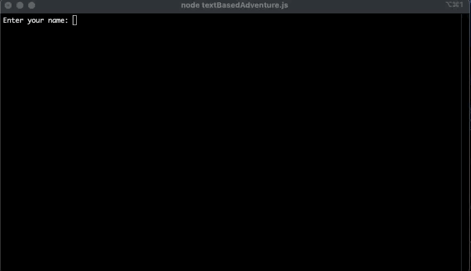

# Academicus
Text-Based Adventure Game.

### 1. Running the application
Click link to go to game repo: https://github.com/jamee-maker/FSW-Text-Based-Adventure
<ul>
  <li>Clone the repo</li>
  <li>In your terminal, cd to the cloned repo and run npm install</li>
  <li>Run node textBasedAdventure.js to begin the adventure!</li>
  </ul>
  
### 2. Description of the application

This is a text-based adventure game in which a user is able to make decisions that have an impact on the storyline.
  
  

Throughout the game, the user has to navigate and solve problems that allow the user to advance further. 

### 3. Remarks

  This was the first time I had ever used javascript to create an application. With that being said, I am extremely pleased with the work.
  I spent a lot of time on the code and in particular, I wanted to give the user as many options as possible, so as to simulate actually going on an adventure     where anything could happen.
  
  
  One of my favorite snippets of code is in the dice roll function. In the game, there are two scenario where the user has to guess a number between 1 and 6:
  
   Dice roll scenario 1
   
   
   
   In this scenario the dice is laying stationary on the ground, which means that the number the user has to guess remains constant.
   
   
   
   
   Which means that the dice roll fucntion has to be called before the while loop executes, so that the number remains the same throuhout the loop.
   
   
   Dice roll scenario 2
   
   
   
   
   However in this scenario, the dice is moving constantly. That means that the number to be guessed is in fact changing through every iteration.
   
   
    
   
   
   Therefore here, as you can see above, we need to place our dice roll function within the while loop to reflect the change in circumstance.
  

